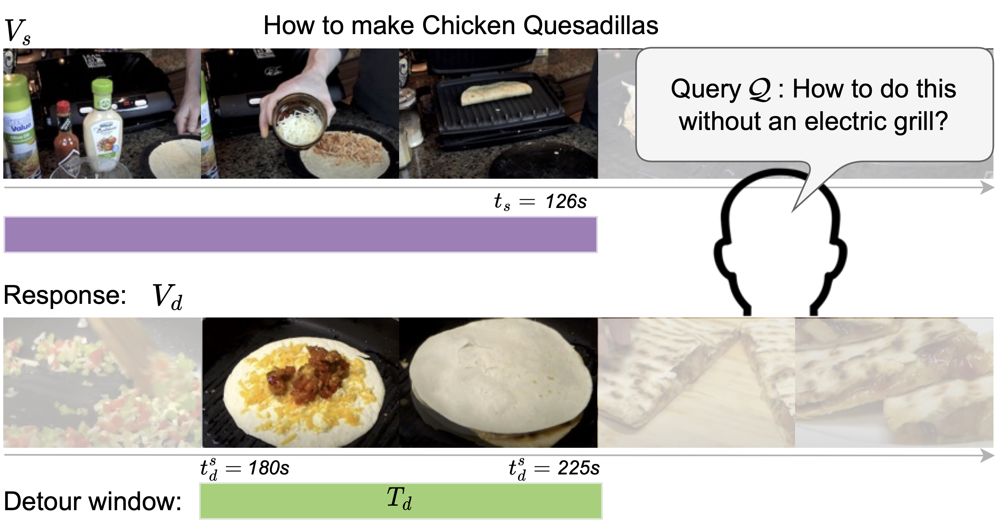

# Detours for Navigating Instructional Videos

Official code of [Detours for Navigating Instructional Videos](https://arxiv.org/abs/2401.01823), CVPR 2024 (highlight).

[](https://arxiv.org/pdf/2401.01823.pdf)  [](https://vision.cs.utexas.edu/projects/detours/)



## Video detours dataset

We propose the first video detours dataset. A detour instance is when the user pauses watching an instructional video and asks the AI assistant a query like "how to do this step without a blender". The assistant should return another instructional video that satisfies the user query while doing the same activity as the original video.

The (weakly-supervised) training dataset can be downloaded [here](https://dl.fbaipublicfiles.com/VidDetours/detours_train_data_llava.json).

The (weakly-supervised) validation dataset can be downloaded [here](https://dl.fbaipublicfiles.com/VidDetours/detours_val_data_llava.json).

The manually annotated testing dataset can be downloaded [here](https://dl.fbaipublicfiles.com/VidDetours/manual_test_set_localization_v3.json).


## HowTo100M summary dataset

We use Llama 2 to summarize HowTo100M cooking videos into distinct steps along with timestamps. These summaries is used to create the video detours dataset. The HowTo100M summary dataset can be downloaded from [here](https://dl.fbaipublicfiles.com/VidDetours/htm_summaries_better_times.json).

## Code usage

### Installation

```
conda create -n detours python=3.10 -y
conda activate detours
pip install --upgrade pip  # enable PEP 660 support
pip install -e .
```

### Video features

We use Internvideo features extracted at 1 features per second. The features can be downloaded or extracted following [TAN](https://github.com/TengdaHan/TemporalAlignNet/tree/main/htm_zoo#visual-features) codebase.


### Dataset download

| Task                      | Train dataset | Validation dataset | Test dataset |
|---------------------------|---------------|--------------------|--------------|
| Detour video retrieval    | [here](https://dl.fbaipublicfiles.com/VidDetours/detours_train_data_retrieval_full_video_llava.json) | [here](https://dl.fbaipublicfiles.com/VidDetours/detours_val_data_retrieval_full_video_llava.json) | [here](https://dl.fbaipublicfiles.com/VidDetours/manual_test_set_retrieval_full_video_v3.json) |
| Detour window localization | [here](https://dl.fbaipublicfiles.com/VidDetours/detours_train_data_llava.json) | [here](https://dl.fbaipublicfiles.com/VidDetours/detours_val_data_llava.json) | [here](https://dl.fbaipublicfiles.com/VidDetours/manual_test_set_localization_v3_unique_id.json) |


### Training and inference

To run the retrieval training, run 

```
bash submit_ds_video_retrieval.sh
```

Use `multinode_retrieval.sh` to run on multiple nodes on a SLURM cluster.

To run the localization training, run

```
bash submit_ds_video_localization.sh
```

Use `multinode_localization.sh` to run on multiple nodes on a SLURM cluster.

### Checkpoints

The checkpoints will be released soon.

## Issues

Please open an issue in this repository (preferred for better visibility) or reach out to [kumar.ashutosh@utexas.edu](mailto:kumar.ashutosh@utexas.edu).

## Contributing

See the [CONTRIBUTING](CONTRIBUTING.md) file for how to help out.

## Citation

If you use the code or the method, please cite the following paper:

```bibtek
@misc{ashutosh2024detours,
      title={Detours for Navigating Instructional Videos}, 
      author={Kumar Ashutosh and Zihui Xue and Tushar Nagarajan and Kristen Grauman},
      year={2024},
      eprint={2401.01823},
      archivePrefix={arXiv},
      primaryClass={cs.CV}
}
```

## License

The majority of VidDetours is licensed under [CC-BY-NC](LICENSE.md), however portions of the project are available under separate license terms: LLaVA is licensed under the Apache 2.0 license.
